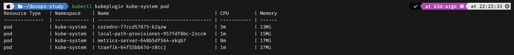

# kubeplugin

## Using a plugin

To use a plugin, make the plugin executable:

```sudo chmod +x ./kubeplugin```

and place it anywhere in your PATH:

```sudo mv ./kubeplugin /usr/local/bin```

You may now invoke your plugin as a kubectl command:

```kubectl kubeplugin <NAMESPACE> <RESOURCE_TYPE>```

Example:
```kubectl kubeplugin kube-system pod```

Output:

